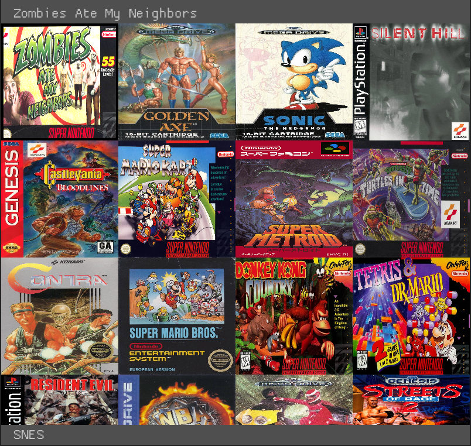

# RetroArcade

An alternative frontend for libretro with an emphasis on Kiosk mode. In other words, an emulation menu.



## Disclaimer

This project was not really made for outside usage, but I decided to document it a bit anyway both for my future self and for anyone checking out my GitHub profile. There will probably be bugs. If you find any, just let me know by submitting an issue.

The emulation runs pretty slow on a normal Rust debug build, so make sure to build the project on release mode.

## Features

Not all libretro cores work. Tested and working cores include:

- FCEUmm
- Snes9x 2010
- Genesis Plus GX
- PrBoom

The Beetle PSX core also works, but presents issues with performance and resolution adjusting.

## Installation

You need:

- Latest Rust nightly
- wget and unzip (for the OpenVGDB installation script)

On Debian:

```bash
# Install dependencies
$ sudo apt-get install -y libssl-dev libasound2-dev libudev-dev libaio-dev libglu1-mesa-dev
# Download project
$ git clone https://github.com/Sinono3/retroarcade
$ cd retroarcade
# Download OpenVGDB
$ ./scripts/download_openvgdb.sh
# Create necessary directories
$ mkdir cores roms cache
# Build and run the project
$ cargo run -r
```

On other systems, everything should be the same, except for the dependencies, which will vary for each package manager.

You can also bootstrap a Debian Testing installation to automatically install RetroArcade and launch it at boot, using [`retroarcade-setup`](https://github.com/Sinono3/retroarcade-setup).

## Usage and configuration

You can modify the configuration in retroarcade.toml to your liking. Only ROMs in OpenVGDB will be detected and have their covers scraped, the rest will be shown with a random color.

### Adding systems/cores

You must download their respective cores from the [libretro buildbot](http://buildbot.libretro.com/nightly/linux/x86_64/latest/), extract them and place them on the cores directory. You can also build the cores yourself.

### Adding games/ROMs

Simply place the ROMs in the directory specified in the configuration. You can also create subdirectories, since the ROMs directory is recursively searched.

## Origin

This was made for a demonstration project presented during the *Expo Técnica* of the *Colegio Técnico Nacional de Asunción* on the 9th of September, 2022.
